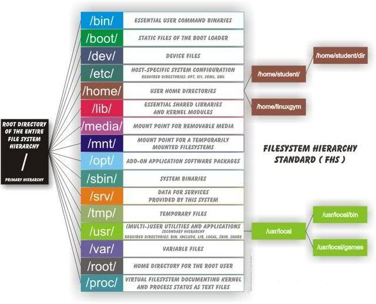

# Linux

## Directory Structure

* **/bin** : All the executable binary programs (file) required during booting, repairing, files required to run into single-user-mode, and other important, basic commands viz., cat, du, df, tar, rpm, wc, history, etc.
* **/boot** : Holds important files during boot-up process, including Linux Kernel.
* **/dev** : Contains device files for all the hardware devices on the machine e.g., cdrom, cpu, etc
* **/etc** : Contains Application’s configuration files, startup, shutdown, start, stop script for every individual program.
* **/home** : Home directory of the users. Every time a new user is created, a directory in the name of user is created within home directory which contains other directories like Desktop, Downloads, Documents, etc.
* **/lib** : The Lib directory contains kernel modules and shared library images required to boot the system and run commands in root file system.
* **/lost+found** : This Directory is installed during installation of Linux, useful for recovering files which may be broken due to unexpected shut-down.
* **/media** : Temporary mount directory is created for removable devices viz., media/cdrom.
* **/mnt** : Temporary mount directory for mounting file system.
* **/opt** : Optional is abbreviated as opt. Contains third party application software. Viz., Java, etc.
* **/proc** : A virtual and pseudo file-system which contains information about running process with a particular Process-id aka pid.
* **/root** : This is the home directory of root user and should never be confused with ‘/‘
* **/run** : This directory is the only clean solution for early-runtime-dir problem.
* **/sbin** : Contains binary executable programs, required by System Administrator, for Maintenance. Viz., iptables, fdisk, ifconfig, swapon, reboot, etc.
* **/srv** : Service is abbreviated as ‘srv‘. This directory contains server specific and service related files.
* **/sys** : Modern Linux distributions include a /sys directory as a virtual filesystem, which stores and allows modification of the devices connected to the system.
* **/tmp** :System’s Temporary Directory, Accessible by users and root. Stores temporary files for user and system, till next boot.
* **/usr** : Contains executable binaries, documentation, source code, libraries for second level program.
* **/var** : Stands for variable. The contents of this file is expected to grow. This directory contains log, lock, spool, mail and temp files.
