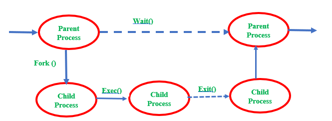

## Zombie Processes
A Zombie is a process that has completed its task but still, it shows an entry in a process table. The zombie process usually occurred in the child process. Very short time the process is a zombie. After the process has completed all of its tasks it reports the parent process that it has about to terminate.
Zombie is unable to terminate itself because it is treated as a dead process. So parent process needs to execute to terminate the command to terminate the child.is 

### How one can kill a Zombie process?
Zombie processes are already dead, one can't kill something which is dead. To remove, zombie processes entries from system `ps -A -ostate,ppid | awk '/[zZ]/ {print $2}'` can be used.
This basically removes the process entry from the process table.

## What are orphan proceses?
A child process that remains running even after its parent process is terminated or completed without waiting for the child process execution is called an orphan. A process becomes an orphan unintentionally. Some time intentionally becomes orphans due to long-running time to complete the assigned task without user attention.
